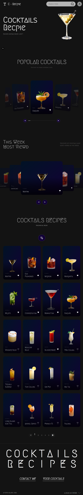
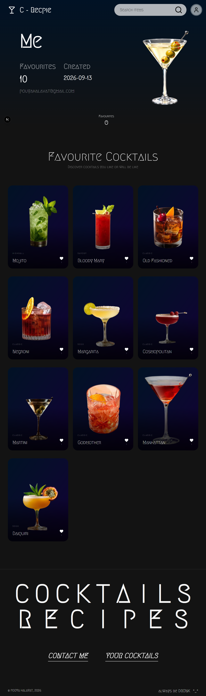
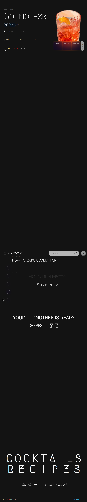
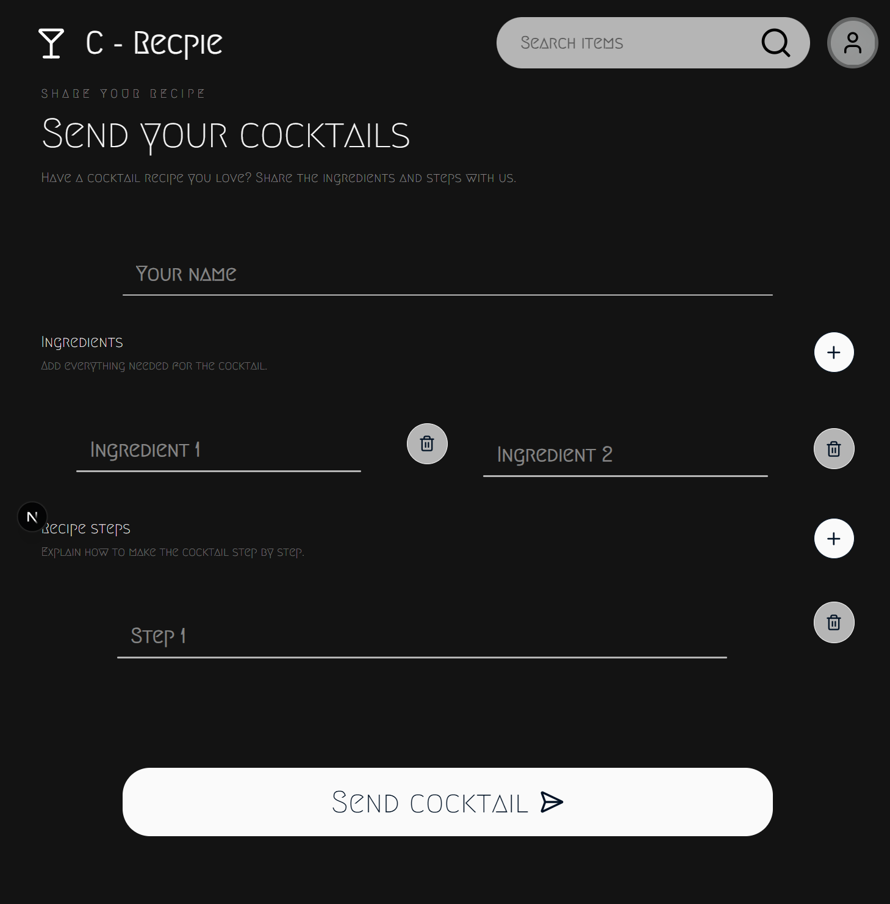

# 🍸 Cocktail Recipe

A modern cocktail discovery and recipe platform built with **Next.js, React, TypeScript, Tailwind CSS, and GSAP**.

The project is designed around an immersive, interactive experience for discovering cocktails, exploring recipes, and saving favorite drinks.

> 🚧 This project is currently under development.

---

## ✨ Overview

**Cocktail Recipe** is a modern web application for discovering cocktails through an interactive and visually focused interface.

Users can:

- 🔎 Search for cocktails
- 🍸 Explore popular cocktails
- 👀 Discover the most viewed cocktails
- 📚 Browse the complete recipe collection
- 🏷️ Filter cocktails by drink type
- 📊 Sort recipes by popularity
- ⚡ View cocktail difficulty
- 📖 Open individual cocktail recipe pages
- ❤️ Save cocktails to favorites
- 🔐 Log in to manage favorite cocktails
- 📱 Use the application across mobile, tablet, and desktop

The project focuses heavily on **smooth interactions, visual presentation, reusable components, and modern animations**.

---

## 🚀 Features

### 🔎 Cocktail Search

Search for cocktails by name through an interactive search interface.

The search experience is designed to be fast and visually engaging, with animated interactions powered by GSAP.

### 🍸 Popular Cocktails

A dedicated section showcasing popular cocktails.

The section uses an interactive gallery experience with:

- Cocktail imagery
- Favorite counts
- Favorite interaction
- Difficulty information
- Alcohol type
- Hover animations
- Interactive navigation
- Touch support

### 👀 Most Viewed This Week

Discover cocktails that have received the most views during the current week.

This section gives users another way to discover drinks beyond the main popular collection.

### 📚 All Recipes

Browse the complete cocktail collection.

Users can filter and organize recipes using options such as:

- Drink type
- Popularity
- Difficulty

Example drink types include:

- Vodka
- Gin
- Rum
- Whiskey
- Tequila
- Other cocktail categories

### 📖 Cocktail Details

Each cocktail has its own recipe page containing:

- Cocktail name
- Cocktail image
- Ingredients
- Required materials
- Preparation instructions
- Alcohol type
- Difficulty
- Favorite functionality

### ❤️ Favorites

Logged-in users can save cocktails to their personal favorites.

The favorite interaction includes an animated heart state to provide immediate visual feedback.

### 🎞️ GSAP Animations

GSAP is used throughout the project for purposeful UI interactions and motion, including:

- Entrance animations
- Scroll animations
- Image animations
- Hover interactions
- Search interactions
- Gallery movement
- Micro-interactions
- Page transitions

Animations are designed to remain smooth, modern, purposeful, and performant.

---

## 🛠️ Tech Stack

| Technology       | Purpose                        |
| ---------------- | ------------------------------ |
| **Next.js**      | Application framework          |
| **React**        | UI development                 |
| **TypeScript**   | Type-safe application code     |
| **Tailwind CSS** | Styling and responsive layouts |
| **GSAP**         | Animations and interactions    |

These technologies are the project's required core stack.

---

## 🎨 Design System

The project uses a deliberately limited color palette to maintain a consistent visual identity.

### Primary Colors

| Usage        | Color     |
| ------------ | --------- |
| Background   | `#131313` |
| Primary text | `#fafafa` |
| Secondary    | `#011225` |
| Accent       | `#110036` |

The main background and primary text colors are fixed throughout the project, while the secondary colors are used for supporting visual elements, gradients, cards, accents, and effects.

The project avoids arbitrary colors and instead maintains the established palette throughout the interface.

---

## 🧩 Project Structure

The project follows a component-based architecture built around Next.js and React.

```text
src/
├── app/
│   ├── page.tsx
│   ├── ...
│   │
│   └── cocktails/
│       └── [slug]/
│           └── page.tsx
│
├── components/
│   ├── Navbar/
│   ├── Search/
│   ├── Gallery/
│   ├── CocktailCard/
│   └── ...
│
├── lib/
│   └── ...
│
└── ...
```

Components are kept modular and reusable, with an emphasis on avoiding unnecessary duplication and oversized components.

---

## 📦 Installation

Clone the repository:

```bash
git clone <your-repository-url>
```

Move into the project:

```bash
cd <project-folder>
```

Install dependencies:

```bash
pnpm install
```

Start the development server:

```bash
pnpm dev
```

Open the application at:

```text
http://localhost:3000
```

---

## ⚙️ Environment Variables

If the project requires environment variables, create a `.env.local` file in the root directory:

```env
# Example

NEXT_PUBLIC_API_URL=
DATABASE_URL=
```

> Do not commit `.env.local` or any private credentials to the repository.

---

## 🧑‍💻 Development

The project uses **TypeScript** throughout the application.

React components use `.tsx` files, Tailwind CSS is used for styling, and GSAP is used whenever animation is required.

When adding new functionality:

1. Check whether an existing component can be reused.
2. Keep components focused and modular.
3. Use TypeScript types instead of unnecessary `any`.
4. Follow the existing design system.
5. Use the official project colors.
6. Keep the interface responsive.
7. Use GSAP for required animations.
8. Avoid modifying unrelated functionality.

---

## 📱 Responsive Design

The interface is designed to work across:

✔️ 📱 Mobile
✔️ 📲 Tablet
✔️ 💻 Desktop
❌ 🖥️ Large screens

Responsive behavior is implemented using Tailwind CSS responsive utilities.

---

## 🎯 Project Goals

The main goals of this project are to create:

- A visually strong cocktail discovery experience
- A reusable and maintainable React architecture
- Smooth GSAP-powered interactions
- Responsive layouts
- A scalable recipe system
- A practical favorites system
- A polished portfolio project

The project prioritizes visual consistency across typography, spacing, cards, buttons, hover states, layouts, and animations.

---

## 🧠 What I Learned

This project is also being used to develop practical experience with:

- Next.js application architecture
- React component design
- TypeScript
- Tailwind CSS
- GSAP animations
- Responsive UI development
- Interactive galleries
- Search interfaces
- Dynamic routes
- Authentication
- Favorites systems
- API and database integration
- SEO
- Production deployment

---

## 🚀 Future Improvements

Possible future improvements include:

- Advanced cocktail search
- Ingredient-based search
- More filtering options
- Personalized recommendations
- Improved favorites management
- More advanced cocktail categories
- Additional GSAP page transitions
- Performance optimization
- Accessibility improvements
- Progressive image loading
- Expanded cocktail database

---

## 📸 Screenshots

> Screenshots will be added as the project interface is finalized.

### Home



### Profile Page



### Cocktail Details



### Send cocktails



---

## 📄 License

This project is currently a personal portfolio project.

If you want to use the code or assets from this repository, please check the repository license and individual asset licenses first.

---

## 👨‍💻 Author

**Pouya**

Built with:

**Next.js · React · TypeScript · Tailwind CSS · GSAP**

---

⭐ If you find this project interesting, feel free to explore the repository and follow its development.
